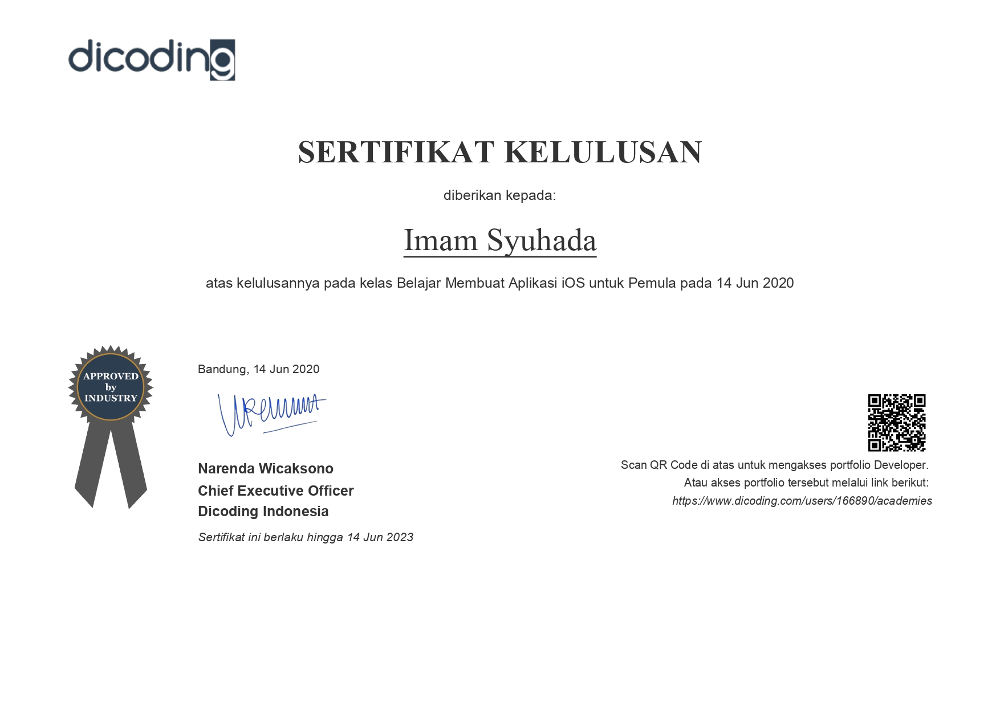

# LayananMaskam versi iOS - Submission Dicoding

## Expectations

## Reality

## Passed

## Perhatian
Bagi teman-teman yang sedang mengikuti kelas dicoding [Belajar Membuat Aplikasi iOS Untuk Pemula](https://www.dicoding.com/academies/171). Silakan gunakan repo sebagai bahan referensi, tapi TIDAK untuk kopi-paste dan di-submit secara utuh tanpa tau cara implementasinya.

